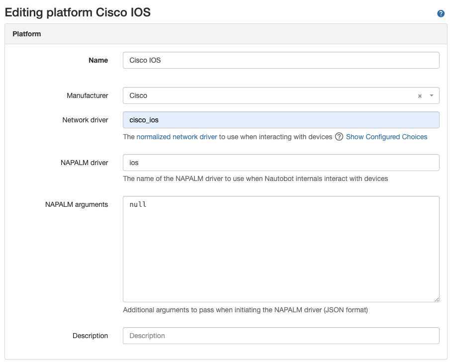

# Using the App

This document describes common use-cases and scenarios for this App utilizing the exposed SSoT jobs.

## General Usage

This App can be used in three general ways.

1. Onboard a device with basic information. (Name, Serial, Device Type, Management IP + Interface)
2. Take existing devices and enhance the data for each device by syncing in more metadata. (Interface, VLANs, VRFs, Cabling, etc.)
3. Both 1 and 2 in conjunction with each other.

### Preparation

To properly onboard a device, a user needs to provide, at a minimum:

1. The Device's Location
2. The Device's primary IP address or DNS Name
3. Selecting other attributes metadata needed. (Default statuses, roles, etc.)

!!! note
    For DNS Name Resolution to work, the Celery instance of Nautobot must be able to resolve the name of the device to IP address.

If `Platform`, `Device Type` and/or `Role` are not provided, the plugin will try to identify this information automatically and, based on the settings, it can create them in Nautobot as needed.

!!! note
    The SSoT jobs use nornir-netmiko to run the show commands defined in the command mappers.

#### SSH Autodetect

The `nautobot-device-onboarding` apps `Sync Devices` job recognizes platform types with a Netmiko SSH Autodetect mechanism. The user may need to specify additional information for platforms where Netmiko's `ssh_autodetect` feature does not work.

[Here is the list](https://github.com/ktbyers/netmiko/blob/v3.4.0/netmiko/ssh_autodetect.py#L50) of platforms supported by `ssh_autodetect`.

The `nautobot-device-onboarding` app can be used with any devices that are supported by NAPALM. Even custom NAPALM driver plugins can be used with a bit of effort.

The table below shows which common platforms will be SSH auto-detected by default.

|Platform     |Platform Autodetect|
--------------|--------------------
Juniper/Junos | Yes (when running Netconf over SSH)|
Cisco IOS-XE  |Yes|
Cisco NXOS (ssh) | Yes|
Cisco NXOS (nxapi)| No|
Arista EOS | No|

For the platforms where SSH auto-detection does not work, the user will need to:

1. Select the platform in the job inputs form.

### IOS and Junos Auto-Created Platforms

The Onboarding App will automatically create Platforms for vendor operating systems where platform auto-detection works. The picture below shows the details of auto-created Platforms for `cisco_ios` and `juniper_junos`.




### Passing Custom Nornir Connection Options

Device Onboarding 4.0 uses Netmiko as the automation engine that queries the devices for information; more specifically, nornir-netmiko. To extend the device onboarding app to pass `extras` to the connection options the following can be added to `nautobot_plugin_nornir` `PLUGIN_CONFIG`.

```python
PLUGINS_CONFIG = {
    "nautobot_device_onboarding": {},
    "nautobot_plugin_nornir": {
        "nornir_settings": {
            "... omitted ..."},
        "connection_options": {
            "netmiko": {
                "extras": {  # <==== passed into the connection setup.
                    "fast_cli": False,
                    "read_timeout_override": 30,
                },
            },
        },
    },
}
```

When the on-demand inventory is created for the `Sync Device from Network` job, the extras in the `netmiko` connection dictionary are added to the connection setup.

### Using SSH PubKey Authentication

In the case where you want to use SSH Public Key authentication that can be accomplished by adding the additional arguments into Netmiko. This is done using the plugin configuration.

1. Create the ssh key on the Nautobot worker server/container.

2. Add the Netmiko Extras to the configuration.

```python
PLUGINS_CONFIG = {
    "nautobot_device_onboarding": {},
    "nautobot_ssot": {
        "hide_example_jobs": True,
    },
    "nautobot_plugin_nornir": {
        "nornir_settings": {
            "credentials": "nautobot_plugin_nornir.plugins.credentials.nautobot_secrets.CredentialsNautobotSecrets",
            "runner": {
                "plugin": "threaded",
                "options": {
                    "num_workers": 20,
                },
            },
        },
        "connection_options": {
            "netmiko": {
                "extras": {
                    "use_keys": True,
                    "key_file": "/root/.ssh/id_rsa",
                    "disabled_algorithms": {"pubkeys": ["rsa-sha2-256", "rsa-sha2-512"]},
                },
            },
        },
    },
}
```

3. Make a secrets group in Nautobot which has the accurate `username` to use along with the key specified in configuration above.

4. Run the jobs and ssh public key authentication will be used.

### Using SSH Proxy Jumphost

In the case where you want to use a SSH proxy jumphost, it can be accomplished by adding the additional arguments into Netmiko. This is done using the plugin configuration.

1. Follow the standard Jumphost proxy setup to create the ssh_config file with the proper settings.

For example:

```
root@fcdc254e2a36:/source# cat /root/.ssh/config

host jumphost
  IdentitiesOnly yes
  IdentityFile ~/.ssh/id_rsa
  User ntc
  HostName 10.1.1.10

host * !jumphost
  User admin
  KexAlgorithms +diffie-hellman-group1-sha1,diffie-hellman-group14-sha1,diffie-hellman-group-exchange-sha1
  HostKeyAlgorithms +ssh-rsa
  ProxyCommand ssh -F /root/.ssh/config -W %h:%p jumphost
```

2. Add the Netmiko Extras to the configuration.

```python
PLUGINS_CONFIG = {
    "nautobot_device_onboarding": {},
    "nautobot_ssot": {
        "hide_example_jobs": True,
    },
    "nautobot_plugin_nornir": {
        "nornir_settings": {
            "credentials": "nautobot_plugin_nornir.plugins.credentials.nautobot_secrets.CredentialsNautobotSecrets",
            "runner": {
                "plugin": "threaded",
                "options": {
                    "num_workers": 20,
                },
            },
        },
        "connection_options": {
            "netmiko": {
                "extras": {
                    "ssh_config_file": "/root/.ssh/config",
                },
            },
        },
    },
}
```

3. Run the jobs and the ssh config will be used and the connection will be proxied through the jumphost.

# Use-cases and common workflows

## Onboarding a Device

### Onboard a New Device Using Sync Devices From Network Job

A new device can be onboarded via :

- A SSoT job execution using the `Sync Devices from Network` job.
    - Via Jobs menu
    - Via SSoT Dashboard
- API, via a `POST` to `/api/extras/jobs/SSOTSyncDevices/run` or `/api/extras/jobs/{id}/run` 

!!! note
    The SSoT Job's ID (UUID) will be different per Nautobot instance. 

During a successful onboarding process, a new device will be created in Nautobot with its management interface and its primary IP assigned. The management interface will be discovered on the device based on the IP address provided.

This SSoT job supports a bulk CSV execution option to speed up this process.

### Example CSV 
```
ip_address_host,location_name,device_role_name,namespace,device_status_name,interface_status_name,ip_address_status_name,secrets_group_name,platform_name,set_mgmt_only,update_devices_without_primary_ip,
192.168.1.1,"Test Site",Onboarding,Global,Active,Active,Active,"test secret group",,False,True
```

### Consult the Status of the Sync Network Devices SSoT Job

The status of onboarding jobs can be viewed via the UI (Jobs > Job Results) or retrieved via API (`/api/extras/job-results/`) with each process corresponding to an individual Job-Result object.

### API

To run the SSoT Sync Devices Job via the api:

Post to `/api/extras/jobs/SSOTSyncDevices/run/` with the relevant onboarding data: 

```bash
curl -X "POST" <nautobot URL>/api/extras/jobs/SSOTSyncDevices/run/ -H "Content-Type: application/json" -H "Authorization: Token $NAUTOBOT_TOKEN" -d '{"data": {"location": "<valid location UUID>", "ip_address": "<reachable IP to onboard>", "port": 22, "timeout": 30}}
```

Required Fields:
    location: Location UUID
    ip_address: String of IP or CSV of IPs
    port: Integer
    timeout: Integer

Optional Fields:
    credentials: Secret Group UUID
    platform: Platform UUID
    role: Role UUID
    device_type: Device Type UUID
    continue_on_failure: Boolean

## Onboarding Interface, Vlans, IPs Etc.

### Enhance Existing Device

An existing device's data can be expanded to include additional objects by:

- A SSoT job execution.
    - Via Jobs menu
    - Via SSoT Dashboard
- API, via a `POST` to `/api/extras/jobs/SSOTSyncNetworkData/run` or `/api/extras/jobs/{id}/run` 

!!! note
    The SSoT Job's ID (UUID) will be different per Nautobot instance. 

During a successful network data sync process, a devices related objects will be created in Nautobot with all interfaces, their IP addresses, and optionally VLANs, and VRFs.

### Consult the Status of the Sync Network Data SSoT Job

The status of onboarding jobs can be viewed via the UI (Jobs > Job Results) or retrieved via API (`/api/extras/job-results/`) with each process corresponding to an individual Job-Result object.

### API

To run the SSoT Sync Network Data Job via the api:

Post to `/api/extras/jobs/SSOTSyncNetworkData/run/` with the relevant onboarding data: 

```bash
curl -X "POST" <nautobot URL>/api/extras/jobs/SSOTSyncNetworkData/run/ -H "Content-Type: application/json" -H "Authorization: Token $NAUTOBOT_TOKEN" -d '{"data": {"devices": "<valid devices UUID>"}
```

Required Fields:
    devices: Location UUID


## Using Git(Datasources) to Override the Apps Defaults

### YAML Overrides

By utilizing the Nautobot core feature `Datasource` the command mappers, jpaths, post_processors for each platform can be overridden. This also gives an easy way for a user to add platform support without having to get those fixes directly upstreamed into this application.

The format of these YAML files are and how to extend this application is covered in [App YAML Overrides](./app_yaml_overrides.md).


### Parser Templates

As this App continues to mature, support has been added to support `TTP`; with this addition the ability to add and/or override templates was required. This follows a similar pattern to the YAML overrides.

### TTP Parser Extensions

!!! info
    To avoid overly complicating the merge logic, the App will always prefer the template files loaded in from the git repository.

File structure:
```bash
.
├── README.md
└── onboarding_command_mappers
    └── parsers
        └── ttp
            └── <network_driver>_<command seperated by underscores>.ttp
```

When loading from a Git Repository this App is expecting a root directory called `onboarding_command_mappers`. Parser files should be located in a `parsers` directory followed by one additional directory; e.g., `ttp`. The template file names must be named `<network_driver>_<command_seperated_by_underscores>.ttp`.

### Textfsm Parser Extensions

!!! info
    To avoid overly complicating the merge logic, the App will always prefer the template files loaded in from the git repository. If a template isn't found in the git repository it will fallback to using native ntc-templates directory.

File structure:
```bash
.
├── README.md
└── onboarding_command_mappers
    └── parsers
        └── textfsm
            └── <network_driver>_<command seperated by underscores>.textfsm
            └── index
```

!!! warn
    The repository **must** have an index file as is always expected with textfsm.

When loading from a Git Repository this App is expecting a root directory called `onboarding_command_mappers`. Parser files should be located in a `parsers` directory followed by one additional directory; e.g., `textfsm`. The template file names must be named `<network_driver>_<command_seperated_by_underscores>.ttp` and the index file must exist and must be defined appropriately.

For example:

```
└── onboarding_command_mappers
    └── parsers
        └── textfsm
            └── cisco_ios_show_version.textfsm
            └── index
```

Where index file is:

```
Template, Hostname, Platform, Command

cisco_ios_show_version.textfsm, .*, cisco_ios, sh[[ow]] ver[[sion]]
```
